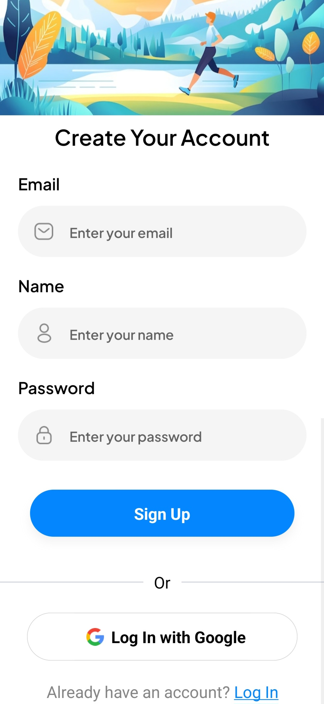
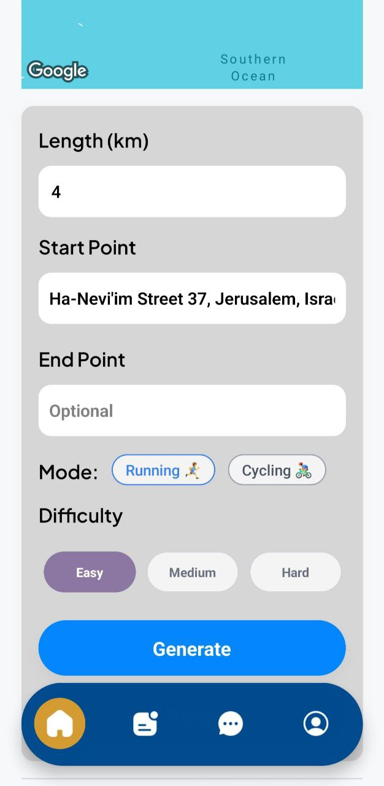
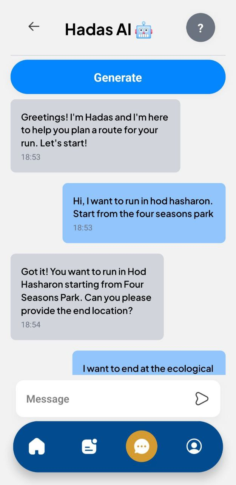
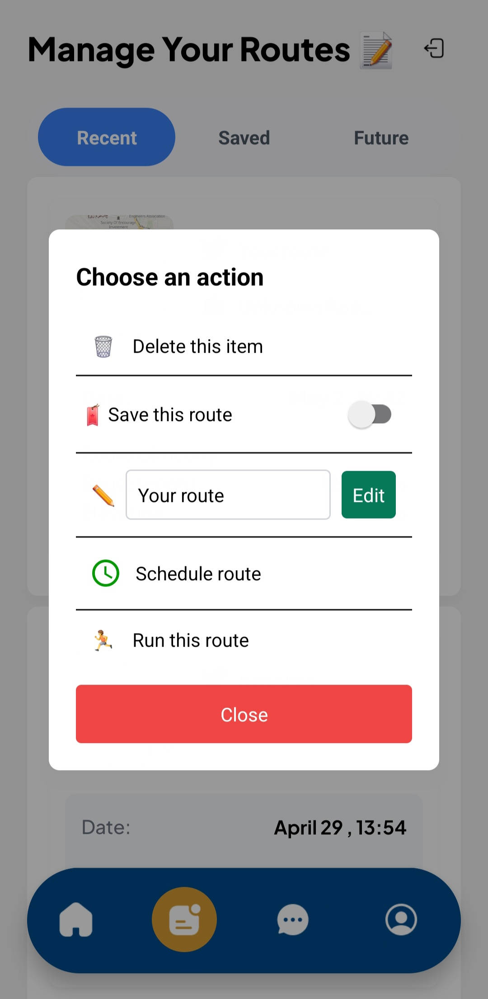
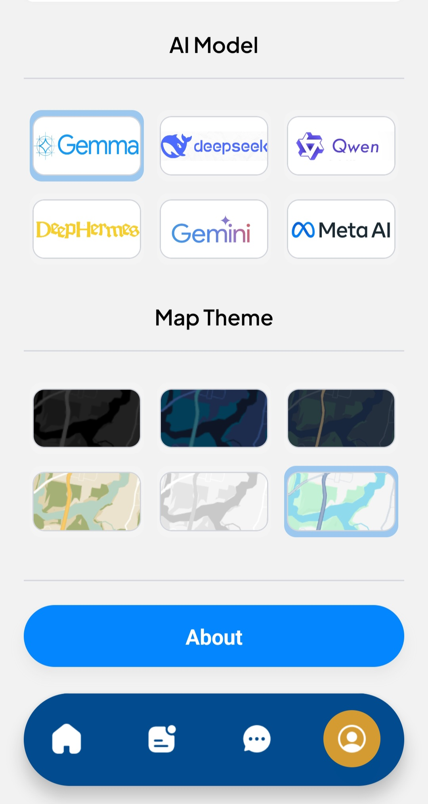

# DRunner

  

## About the App

This app helps runners find the best routes based on their preferences. Whether you’re looking for a specific distance, difficulty level, or starting point, the smart chatbot—powered by six AI APIs—creates optimized routes for you. Integrated with Google Maps, it ensures accurate and easy-to-follow paths, making every run more enjoyable. You can also ask the chatbot for advice on where to run, how long, or anything else related to running. Additionally, you can **save and schedule routes** and **view your running history** to track past runs.

This project is our final project as 3rd-year computer science students.

[](https://www.youtube.com/watch?v=4LcknZpmIZA)

### Authors:

[](https://www.linkedin.com/in/ron-avital/) Ron Avital - ronav@edu.jmc.ac.il <br>

[](https://www.linkedin.com/in/david-weschler/) David Weschler - davidwes@edu.jmc.ac.il

## Why Use This App?

- **Personalized Routes** – Get paths based on your distance, difficulty, and location.
- **Smart Chatbot** – Ask for running tips and advice.
- **Accurate & Reliable** – Routes adjust to real roads with Google Maps.
- **Save & Schedule** – Store routes or plan them for later.
- **Running History** – Track past runs and stats.
- **Easy to Use** – Simple design for quick route planning.

## Features

- AI-powered chatbot for personalized running routes
- Google Maps integration for real-road accuracy
- Save and schedule routes for future runs
- View past running history and track stats
- Simple, user-friendly interface
- Secure authentication with Clerk
- Database powered by Neon

## App Preview

| Account Creation                                        | Preferences (Manual or Chatbot)                                                                               | Route Generation                                                     |
| ------------------------------------------------------- | ------------------------------------------------------------------------------------------------------------- | -------------------------------------------------------------------- |
|  |   | </img> |

| Route Management                                       | Map & AI Customization                                 |
| ------------------------------------------------------ | ------------------------------------------------------ |
|  |  |

##

## Installation

### Prerequisites

- [Node.js](https://nodejs.org/) installed on your machine
- [Expo Go](https://expo.dev/client) installed on your mobile device (SDK 52)
- API keys for:
  - Google Maps
  - AI chatbot services
  - Clerk authentication
  - Neon database connection

### Steps

1. Clone this repository:
   ```sh
   git clone https://github.com/ron-avital29/run_app.git
   cd run_app
   ```
2. Install dependencies:
   ```sh
   npm install
   ```
3. Create a `.env` file in the root directory and add the required API keys:
   ```sh
   EXPO_PUBLIC_CLERK_PUBLISHABLE_KEY=your_clerk_publishable_key
   DATABASE_URL=your_database_url
   EXPO_PUBLIC_SERVER_URL=your_server_url
   EXPO_PUBLIC_GEOAPIFY_API_KEY=your_geoapify_api_key
   EXPO_PUBLIC_OPEN_WEATHER_API_KEY=your_open_weather_api_key
   EXPO_PUBLIC_GOOGLE_API_KEY=your_google_api_key
   EXPO_PUBLIC_OPENROUTER_API_KEY=your_openrouter_api_key
   ```
4. Start the app:
   ```sh
   npx expo start
   ```
5. Scan the QR code using Expo Go on your mobile device to run the app.

## Technologies Used

- **React Native & Expo** – For cross-platform mobile development
- **TypeScript** – For type-safe coding
- **Google Maps API** – For accurate route adjustments
- **AI Chatbot (6 APIs)** – For generating optimized running routes
- **Clerk** – For secure authentication
- **Neon** – For database management
- **Jest** - For Unit tests

## Contributing

We welcome contributions! Feel free to fork the repository and submit a pull request with your improvements.

## License

This project is open-source and licensed under the **MIT License**.

[](https://opensource.org/licenses/MIT)
